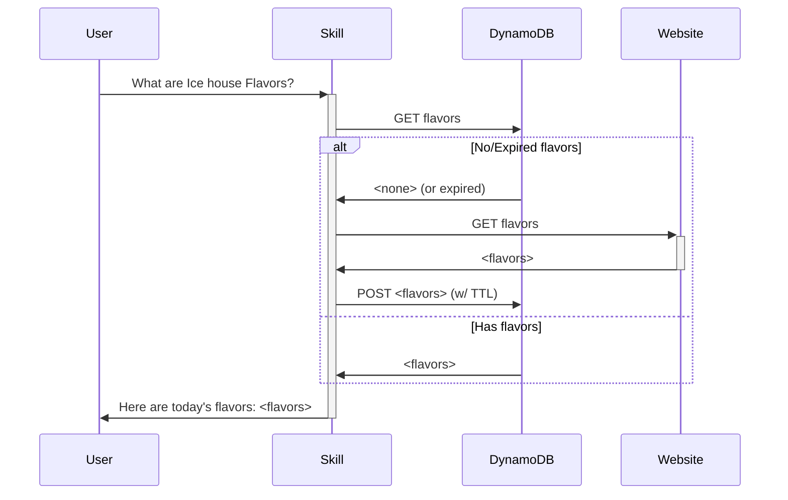

```mermaid

sequenceDiagram

    participant U as User
    participant S as Skill
    participant D as DynamoDB
    participant W as Website

    U->>+S: What are Ice house Flavors?
    S->>D: GET flavors

    alt No/Expired flavors
        D->>S: <none> (or expired)
        S->>+W: GET flavors
        W->>-S: <flavors>
        S->>D: POST <flavors> (w/ TTL)
    else Has flavors
        D->>S: <flavors>
    end

    S->>-U: Here are today's flavors: <flavors>


```